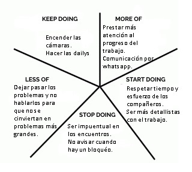
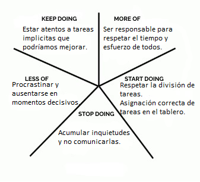
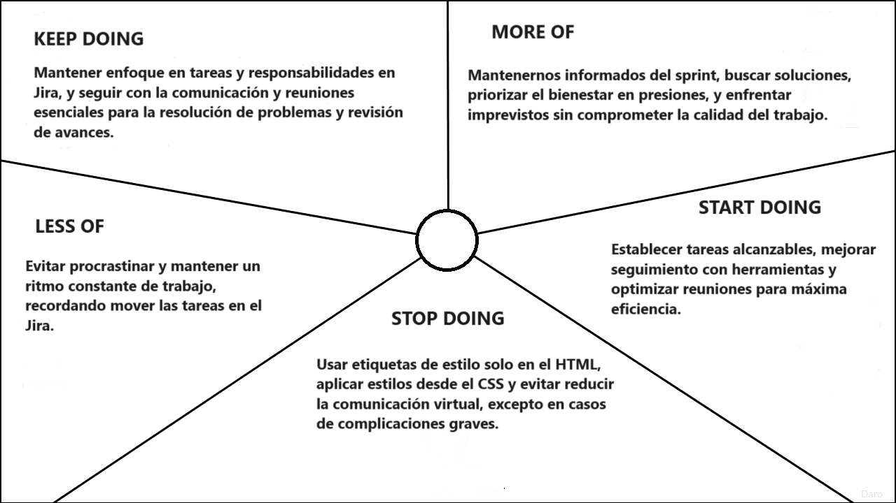
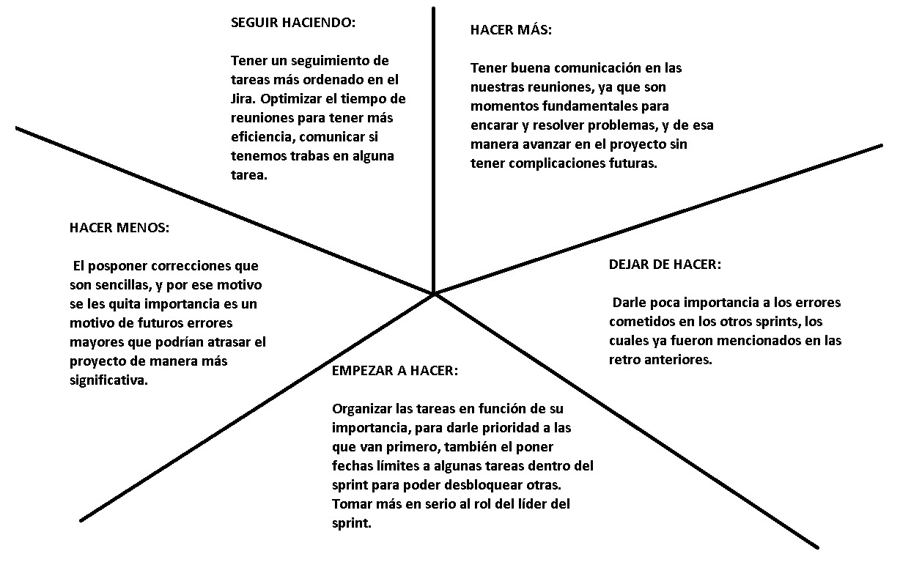
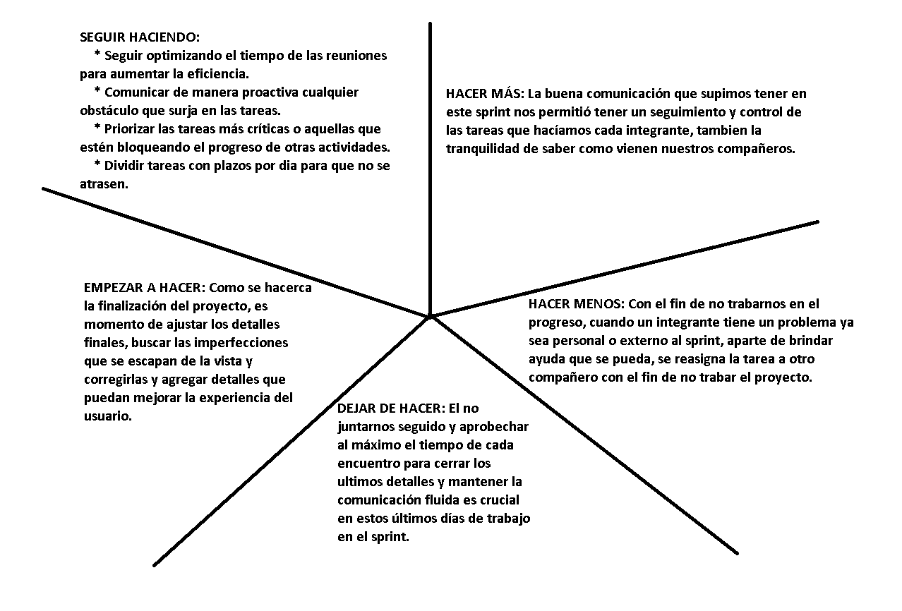

# RETROSPECTIVAS

## Retrospectiva, SPRINT 1

En nuestra primera retrospectiva llegamos a las siguientes conclusiones sobre nuestro primer sprint:

KEEP DOING: Consideramos que desde el primer momento tuvimos un gran respeto por la opinión del otro y siempre consultamos cada detalle del trabajo evitando futuros malentendidos.

MORE OF: Creemos que es muy importante mantener una comunicación constante, es por eso que planteamos reforzar la comunicación por Whatsapp (Nuestro medio principal de comunicación) y contar con el otro, participar y ayudar.

START DOING: Nuevamente hacemos hincapie en la comunicación como equipo y propusimos prender la cámara en cada reunión/daily para poder tener encuentros más cercanos y demostrar el compromiso de cada uno.

STOP DOING: Decidimos dos puntos principales, ignorar los mensajes del grupo para evitar repetir errores y no actualizar el tablero de jira ya que es tan importante como cualquier otro punto de este proyecto.

LESS OF: No respetar lo establecido desde un principio siempre y cuando esta instancia no tenga por motivo la mejora de experiencia del usuario o del proyecto en general.

## Retrospectiva, SPRINT 2

Segunda retrospectiva referida al sprint 2:

SEGUIR HACIENDO: En el primer sprint decidimos encender las cámaras en cada uno de los encuentros que tenemos y creemos que hay que seguir haciendolo ya que es algo fundamental para la comucación y demuestra el interés en el trabajo de cada uno.
Hacer una daily diaria de lunes a viernes que es algo que nos mantiene comunicados y al tanto del progreso de los compañeros.

HACER MÁS: Debemos mejorar en el prestar mas atención al progreso del trabajo, saber en que estado esta y actualizar el jira, tambien debemos mejorar la comunicación por whatsapp.
Otro punto que hay que mejorar es cumplir lo establecido en el sprint anterior, volver a leerlo para tenerlo presente y ponerlo en práctica lo ya pactado.

HACER MENOS: Dejar pasar los problemas y no hablarlos cuando tenemos algo importante que decir que comprometa el progreso del trabajo. 

EMPEZAR A HACER: Respetar el tiempo y el esfuerzo de los compañeros siendo responsable.
Prestar mas atención a los detalles del trabajo y agregar personalidad, para que el trabajo no sea básico, si no que pueda mejorar en detalles que incluso no están especificados en el sprint.

DEJAR DE HACER: Ser impuntual en los horarios pactados en los encuentros. 
No avisar cuando hay un bloqueo que impide avanzar con el trabajo.

## Retrospectiva, SPRINT 3

En nuestra tercera retrospectiva llegamos a las siguientes conclusiones sobre nuestro tercer sprint:

KEEP DOING: Estar atentos a los detalles que no necesariamente sean obligatorios en el sprint pero que puedan ayudar a mejorar el proyecto en algún aspecto. Consideramos que deberíamos hacer de este punto una costumbre para que el trabajo que realicemos sea más genuino.

MORE OF: Es muy importante ser responsable para respetar el tiempo y el esfuerzo de cada integrante, por eso insistimos en reforzar este punto para mantener un ambiente ordenado y cooperativo.

START DOING: Creemos que debemos respetar la división de tareas pactada desde un principio para que la carga de trabajo sea más equitativa y justa para todos, entendiendo como excepción aquellas situaciones en las que un compañero no pueda realizar su tarea por cuestiones de fuerza mayor. Además, en el tablero del Jira deberán estar asignadas como responsables de las tareas aquellas personas que realmente las hayan realizado.

STOP DOING: Acumular inquietudes y no comunicarlas. Para evitar situaciones limites, donde los conflictos pueden pesar más de lo que deberían, entendemos que es sumamente necesario expresarnos, escuchar y ser escuchados.

LESS OF: Procrastinar y, con ello, comprometer el proyecto y al resto del equipo. También queremos evitar que cualquier integrante se ausente en momentos decisivos del sprint tales como reuniones organizativas o entregas.

## Retrospectiva, SPRINT 4

En nuestra cuarta retrospectiva, basados en nuestro último sprint y nuevas ideas, decidimos:

KEEP DOING: Mantendremos el enfoque en la división de tareas acordadas, asegurando las responsabilidades asignadas. Esta práctica se reflejará en el tablero del Jira, donde solo aquellos miembros que hayan completado tareas serán designados como responsables.Continuaremos con la misma práctica de comunicación y reuniones, ya que son elementos fundamentales para la resolución de problemas y la revisión de los avances del proyecto.

MORE OF: Buscar mantenernos informados acerca del sprint. Fomentar la búsqueda de soluciones, priorizar el bienestar individual y grupal apoyándonos mutuamente en situaciones de presión. Enfrentar imprevistos sin comprometer la calidad del trabajo.

START DOING: Establecer las tareas especificadas y alcanzables al plazo justo de entrega. Explorar e implementar herramientas para mejorar el seguimiento de tareas y optimizar el tiempo de las reuniones para maximizar su eficiencia.

STOP DOING: Utilizar etiquetas de estilo en el HTML; aplicar estilos únicamente desde el CSS. Intentar no reducir la comunicación virtual, a menos que algún miembro del grupo tenga complicaciones graves.

LESS OF: Postergar tareas sin implementar estrategias para abordar la procrastinación y sin tener un ritmo constante de trabajo. Esto abarca, por ejemplo, olvidarse de mover las tareas en el Jira.

## Retrospectiva, SPRINT 5

Quinta retrospectiva referida al sprint 5:

SEGUIR HACIENDO: Tener un seguimiento de tareas más ordenado en el Jira. Optimizar el tiempo de reuniones para tener más eficiencia, comunicar si tenemos trabas en alguna tarea.

HACER MÁS: Tener buena comunicación en las nuestras reuniones, ya que son momentos fundamentales para encarar y resolver problemas, y de esa manera avanzar en el proyecto sin tener complicaciones futuras.

HACER MENOS: El posponer correcciones que son sencillas, y por ese motivo se les quita importancia es un motivo de futuros errores mayores que podrían atrasar el proyecto de manera más significativa.

EMPEZAR A HACER: organizar las tareas en función de su importancia, para darle prioridad a las que van primero, también el poner fechas límites a algunas tareas dentro del sprint para poder desbloquear otras.
Tomar más en serio al rol del líder del sprint.

DEJAR DE HACER: Darle poca importancia a los errores cometidos en los otros sprints, los cuales ya fueron mencionados en las retro anteriores. 

## Retrospectiva, SPRINT 6

Sexta retrospectiva referida al sprint 6: 

SEGUIR HACIENDO:Establecer fechas límite para ciertas tareas para una gestión más efectiva del tiempo.Tambien intentar que aunque una tarea esté bloqueada por otra se busque la forma de avanzar en el trabajo y no desaprovechar el tiempo.

HACER MÁS: Seguir optimizando el tiempo de las reuniones para aumentar la eficiencia.
    *Comunicar de manera proactiva cualquier obstáculo que surja en las tareas.
    *Priorizar las tareas más críticas o aquellas que estén bloqueando el progreso de otras actividades

HACER MENOS: Reducir la  posibilidad de retrasos en el sprint al fomentar  un mayor compromiso por parte del equipo,
priorizando la organizacion pactada al inicio del sprint y respetando el tiempo del resto del equipo. 

EMPEZAR A HACER: Implementar medidas para garantizar que los bloqueos se resuelvan en un plazo máximo de dos días, con el fin de evitar retrasos en el trabajo del equipo y fomentar una mayor productividad.

DEJAR DE HACER: Mergear múltiples ramas el día antes de entregar el sprint con el fin de disponer de más tiempo para verificar que todo esté funcionando correctamente .

## Retrospectiva, SPRINT 7

Séptima retrospectiva referida al sprint 7:

SEGUIR HACIENDO:
    * Seguir optimizando el tiempo de las reuniones para aumentar la eficiencia.
    * Comunicar de manera proactiva cualquier obstáculo que surja en las tareas.
    * Priorizar las tareas más críticas o aquellas que estén bloqueando el progreso de otras actividades.
    * Dividir tareas con plazos por dia para que no se atrasen.

HACER MÁS: La buena comunicación que supimos tener en este sprint nos permitió tener un seguimiento y control de las tareas que hacíamos cada integrante, tambien la tranquilidad de saber como vienen nuestros compañeros.

HACER MENOS: Con el fin de no trabarnos en el progreso, cuando un integrante tiene un problema ya sea personal o externo al sprint, aparte de brindar ayuda que se pueda, se reasigna la tarea a otro compañero con el fin de no trabar el proyecto.

EMPEZAR A HACER: Como se hacerca la finalización del proyecto, es momento de ajustar los detalles finales, buscar las imperfecciones que se escapan de la vista y corregirlas y agregar detalles que puedan mejorar la experiencia del usuario.

DEJAR DE HACER: El no juntarnos seguido y aprobechar al máximo el tiempo de cada encuentro para cerrar los ultimos detalles y mantener la comunicación fluida es crucial en estos últimos días de trabajo en el sprint.